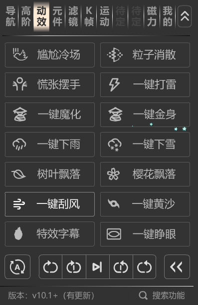

## 没有太大研究价值

### 分析

同一套逻辑
1. 在素材网下载素材(音效,元件素材)
2. 新建图层,音效,动效
3. 把元件素材复制到当前文档 动效图层,舞台居中
4. 把音效复制到当前文档 音效图层
5. 完成

### 可以研究的部分,比较简单
03,04,05,08,12,13

### 吐槽

似乎没有缓存所有下载的素材,每次使用都会重新下载,非常慢

### 注意

+ 素材仅供研究,使用需要版权

