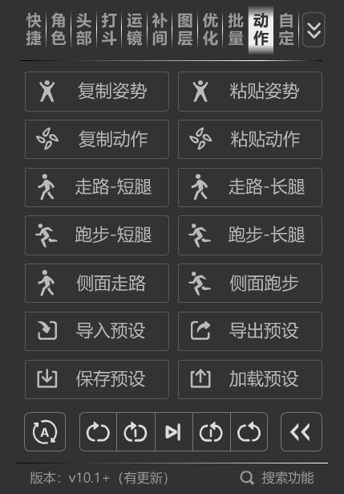

### 📂 动作预设系统设计文档



#### 1. 核心目标

实现动画属性的“复制”与“粘贴”（或应用预设），支持跨元件复用动画效果。

#### 2. 数据采集逻辑

在 `for` 循环中，遍历选定的关键帧（`frs`），采集每个动作片段的起始帧数据。

#### 3. 关键数据结构定义

查看文档api后，可以确定的 需要复制的数据 如下：

| 类别                 | 属性名                      | 数据类型       | 说明                                           |
|--------------------|--------------------------|------------|----------------------------------------------|
| **几何变换**           | `position`               | Point      | **相对位置**,这个属性肯定要单独处理,比如比例问题                  |
|                    | `rotation`               | Number     | 旋转角度。                                        |
|                    | `scale`                  | Number     | 缩放比例                                         |
|                    | `skew`                   | Number     | 倾斜度。                                         |
|                    | `matrix`                 | Matrix     | 矩阵(`跨域剪切` 脚本),可以替代以上4个属性，但是位置信息依旧,要单独处理，比较复杂 |
|                    | `TransformationPoint`    | FlashPoint | 变形点                                          |
|                    | `RegisterPoint`          | FlashPoint | 注册点,(可能考虑),比较麻烦,建议由用户调整                      |
| **时间轴**            | `duration`               | Number     | 该片段的持续帧数。                                    |
| **高级补间**           | `tweenType`              | String     | 补间类型（例如：动画补间、形状补间）。                          |
|                    | `motionTweenRotate`      | String     | 旋转方式（无、自动、顺时针、逆时针）。                          |
|                    | `motionTweenRotateTimes` | Number     | 旋转圈数。                                        |
|                    | `customEase`             | Number[]   | 自定义曲线 ,(可能考虑)                                |
| **滤镜**             | `filters`                | Array      | 滤镜数组（如投影、发光、调整颜色等）。                          |
| **ColorTransform** | `alphaPercent`           | Number     | 透明度等数据。                                      |
|                    |                          |            | 其他数据,(可能考虑)                                  |
| **父子级**            |                          |            | (可能考虑),比较麻烦,建议由用户调整,否则需要考虑图层太多,无法一一对应的问题     |
| **图层顺序**           | `order`                  | Number     | (可能考虑),比较复杂,建议由用户调整,否则需要考虑怎么获取当前图层的顺序问题      |
| **元件内部动画**         | `EditMode`               |            | 只复制最外面的一层,元件里面(不要考虑),否则的话复杂度将非常的高，不如把问题简化。   |

#### 4. 核心难点分析

**“记录”** 是简单的读取 API 操作，但  **“应用”**  是复杂的映射过程。

- **坐标系转换：**
    - `matrix` 坐标系转换,需要熟悉矩阵的运用,`跨域剪切` 脚本
- **元件兼容性：**
    - 如果原元件是影片剪辑，目标元件是图形，某些滤镜或 3D 属性可能无法完美还原。
- **Ease 曲线：**
    - 这是最复杂的部分，通常需要获取缓动值或自定义贝塞尔曲线数据。

#### 5. 预设

- **复制动作** 将 `copyMotions` 数组（包含上述所有 `frameData`）转换为 JSON 字符串。
- **保存预设** 进行加密（如 Base64 或自定义密钥），保存为 `.money` 文件。
- **复制姿势** 对以上数据，进行某方面的优化与修改
- **superjson库** 可以保留Map,Date等元信息,比较适合

#### 示例代码

```javascript
for (var i = 0; i < frs.length; i++) {
    var fr = frs[i];
    var firstLayerIndex = fr.layerIndex;
    var firstFrameIndex = fr.startFrame;

    var firstLayer = layers[firstLayerIndex];
    var firstFrame = firstLayer.frames[firstFrameIndex];
    log.info("复制的第一帧：", firstFrame);

    // if (firstFrame.isEmpty()) {
    //     alert("图层中不能有空帧，请检查！");
    //     // break;
    //     return;
    // }
    var element = firstFrame.elements[0];

    var framePosition = wrapPosition(firstElement);

    var frameData = {};

    // 使用相对位置
    // 将位置变化表示为相对于某个基准点的相对位置
    // (x2-x1)/x1
    frameData.relativeChangeRatio = framePosition.sub(initialPosition);
    // TODO:scale 参数变更
    // .scale(initialPosition.invert());

    log.info("相对位置变化比例：", frameData.relativeChangeRatio);

    frameData.rotation = element.rotation;
    frameData.duration = firstFrame.duration;

    // TODO:frameIndex=undefined
    log.info("frameIndex", firstFrameIndex);
    // 滤镜
    frameData.filters = firstLayer.getFiltersAtFrame(firstFrameIndex);

    // 补间动画
    frameData.tweenType = firstFrame.tweenType;

    frameData.motionTweenRotate = frame.motionTweenRotate;
    frameData.motionTweenRotateTimes = frame.motionTweenRotateTimes;

    // colorAlphaPercent

    // TODO:ease curve

    copyMotions.push(frameData);
}
```

### 最后

这个功能早在去年就研究了，已经有了雏形，但着实没有实现的动力。

- 一来之前的项目，后期js与ts交织，bug比较多，保存系统有概率造成闪退。
- 二来时间有限，这是个比较复杂的功能，理论简单，实现费时间。
- 三来反馈较少，没有做的动力，这个功能需要大量的反馈，奈何基本零反馈。

这也是个人开发者的无力，商业插件，反而有更好的反馈。

所以，`复制动作`就只给出思路了，中等偏上的难度.

`粘贴动作` 功能 预计代码400行以上,比较复杂,实现难度比较高。

### 包含

00,01,02,03,10,11,12,13